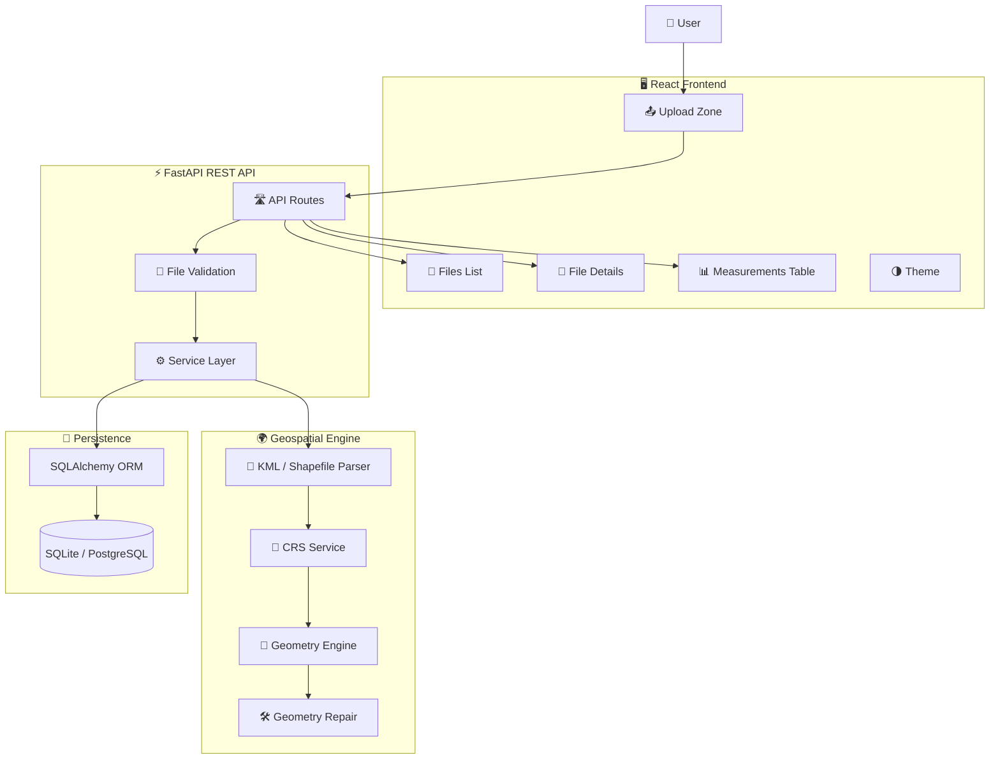

# 🌍 GeoMeasure API

<p align="center">
  
</p>

<p align="center">
  <strong>🗺️ Upload • Analyze • Transform • Measure • Visualize</strong>
</p>

<p align="center">
  A production-quality full-stack geospatial measurement platform for processing
  KML and Shapefile data, automatically handling coordinate reference systems,
  transforming geometries, and calculating accurate area and length measurements.
</p>

<p align="center">
  
  
  
  
  
  
  
  
</p>

<p align="center">
  <a href="#-overview">Overview</a> •
  <a href="#-key-features">Features</a> •
  <a href="#-geospatial-engine">Engine</a> •
  <a href="#-architecture">Architecture</a> •
  <a href="#-api">API</a> •
  <a href="#-setup">Setup</a> •
  <a href="#-deployment">Deployment</a>
</p>

---

# 🛰️ The Project

## 🌎 From Raw Geospatial Files to Measurable Intelligence

**GeoMeasure API** transforms uploaded geospatial files into structured, measurable geographic data.

```text
                         🌍 EARTH DATA
                              │
                              ▼
                    ┌──────────────────┐
                    │  📁 KML / ZIP    │
                    │    Shapefile     │
                    └────────┬─────────┘
                             │
                             ▼
                    ┌──────────────────┐
                    │ 🔐 VALIDATION    │
                    │ File + ZIP Check │
                    └────────┬─────────┘
                             │
                             ▼
                    ┌──────────────────┐
                    │ 🧩 EXTRACTION    │
                    │ Features + Data  │
                    └────────┬─────────┘
                             │
                             ▼
                    ┌──────────────────┐
                    │ 🧭 CRS DETECTION │
                    └────────┬─────────┘
                             │
                             ▼
                    ┌──────────────────┐
                    │ 🌐 PROJECTION    │
                    │ UTM Transformation│
                    └────────┬─────────┘
                             │
                             ▼
                    ┌──────────────────┐
                    │ 📐 MEASUREMENT   │
                    │ Area / Length    │
                    └────────┬─────────┘
                             │
                             ▼
                    ┌──────────────────┐
                    │ 💾 PERSISTENCE   │
                    │ SQLite / Postgres│
                    └────────┬─────────┘
                             │
                             ▼
                    ┌──────────────────┐
                    │ 📊 DASHBOARD     │
                    │ Results + Tables │
                    └──────────────────┘
```

The backend is built with FastAPI and geospatial Python libraries, while the frontend provides a React/TypeScript dashboard for uploading files and inspecting measurements.

---

# ✨ Why GeoMeasure?

Geospatial files contain coordinates, geometry, metadata, and coordinate reference systems — but **coordinates alone are not measurements**.

GeoMeasure handles the complete transformation:

```text
Latitude / Longitude
        ↓
      CRS
        ↓
Projected CRS
        ↓
Planar Geometry
        ↓
Accurate Measurement
```

This is especially important because calculating area or distance directly from geographic coordinates such as EPSG:4326 can produce misleading results.

---

# 🧊 3D-STYLE SYSTEM VIEW

```text
                         ┌─────────────────────────┐
                         │       🌍 GEO DATA       │
                         │                         │
                         │   KML    SHAPEFILE      │
                         └────────────┬────────────┘
                                      │
                                      ▼
              ╔══════════════════════════════════════╗
              ║            ⚙️ PROCESSING             ║
              ║                                      ║
              ║   Validation → Parsing → CRS        ║
              ║              ↓                       ║
              ║      Projection → Geometry          ║
              ║              ↓                       ║
              ║        Measurement Engine           ║
              ╚══════════════════════╤═══════════════╝
                                     │
                                     ▼
                       ┌─────────────────────────┐
                       │      📊 RESULTS         │
                       │                         │
                       │   Area   •   Length     │
                       │   CRS    •   Features   │
                       └────────────┬────────────┘
                                    │
                                    ▼
                       ┌─────────────────────────┐
                       │     🖥️ DASHBOARD        │
                       │                         │
                       │ Files • Details • Table │
                       └─────────────────────────┘
```

---

# 🚀 Key Features

<table>
<tr>
<td width="50%">

## 🗺️ KML Processing

Parse KML files and extract:

- Geometry
- Properties
- Feature metadata
- Extended data

</td>

<td width="50%">

## 📦 Shapefile Processing

Process Shapefile ZIP archives containing:

- `.shp`
- `.shx`
- `.dbf`
- `.prj`
- `.cpg`

</td>
</tr>

<tr>
<td>

## 📐 Precision Measurements

Calculate:

- Polygon area → `m²`
- LineString length → `m`
- MultiPolygon area
- MultiLineString length

</td>

<td>

## 🧭 CRS Intelligence

Automatically:

- Detect source CRS
- Determine UTM zone
- Select measurement CRS
- Transform coordinates

</td>
</tr>

<tr>
<td>

## 🧩 Geometry Handling

Supports:

- Polygon
- MultiPolygon
- LineString
- MultiLineString
- Point
- MultiPoint handling
- GeometryCollection handling

</td>

<td>

## 🛠️ Geometry Repair

Invalid geometries can be detected and repaired using `make_valid` when possible.

</td>
</tr>

<tr>
<td>

## 📊 Professional Dashboard

Includes:

- File upload
- File history
- File details
- Measurement tables
- Measurement summaries

</td>

<td>

## 📖 Developer Experience

Includes:

- REST API
- Swagger
- ReDoc
- Structured errors
- Comprehensive tests

</td>
</tr>
</table>

These capabilities are part of the documented project functionality.

---

# 🧭 Geospatial Intelligence Engine

## 📍 The Measurement Problem

A geographic coordinate such as:

```text
28.6139° N
77.2090° E
```

represents angular coordinates, not meters.

Therefore:

```text
❌ EPSG:4326
      ↓
Direct Area Calculation
      ↓
Potentially Incorrect
```

GeoMeasure instead uses:

```text
✅ EPSG:4326
      ↓
Determine Dataset Centroid
      ↓
Calculate UTM Zone
      ↓
Select Projected CRS
      ↓
Transform Geometry
      ↓
Calculate Area / Length
```

The project explicitly avoids silently assuming a CRS when the source CRS is missing.

---

# 🌐 CRS Transformation Pipeline

```text
                  🌍 GEOGRAPHIC CRS
                       EPSG:4326
                           │
                           ▼
                  Calculate Centroid
                           │
                           ▼
                  Calculate UTM Zone
                           │
                           ▼
             ┌──────────────────────────┐
             │       UTM PROJECTED      │
             │                          │
             │   EPSG:326XX → North     │
             │   EPSG:327XX → South     │
             └────────────┬─────────────┘
                          │
                          ▼
                  Projected Geometry
                          │
                          ▼
                 📐 Area / Distance
```

The UTM formula used by the project is:

```text
Zone = floor((longitude + 180) / 6) + 1
```

Northern hemisphere zones use `EPSG:326XX`, while southern hemisphere zones use `EPSG:327XX`.

---

# 🧮 Measurement Engine

## Polygon

```text
          ┌─────────────────────┐
          │                     │
          │       POLYGON       │
          │                     │
          │        📐           │
          │                     │
          └─────────────────────┘
                    │
                    ▼
              Area in m²
```

## LineString

```text
A ●────────────────────────● B
             📏
              │
              ▼
          Length in m
```

## Point

```text
             📍
             │
             ▼
       NOT_REQUIRED
```

The documented measurement behavior is:

| Geometry | Measurement | Unit |
|---|---|---|
| Polygon | Area | `m²` |
| MultiPolygon | Total area | `m²` |
| LineString | Length | `m` |
| MultiLineString | Total length | `m` |
| Point | None | — |
| MultiPoint | None | — |
| Unsupported geometry | None | — |


---

# 🔄 Complete Processing Pipeline

```text
┌──────────────────────────────────────────────┐
│                 📤 UPLOAD                    │
└───────────────────────┬──────────────────────┘
                        ▼
┌──────────────────────────────────────────────┐
│              🔐 FILE VALIDATION              │
│ Extension • MIME • Size • ZIP Structure      │
└───────────────────────┬──────────────────────┘
                        ▼
┌──────────────────────────────────────────────┐
│              🔍 FORMAT DETECTION             │
│                 KML / SHP ZIP                │
└───────────────────────┬──────────────────────┘
                        ▼
┌──────────────────────────────────────────────┐
│               📦 FILE EXTRACTION             │
│          Safe ZIP extraction                  │
└───────────────────────┬──────────────────────┘
                        ▼
┌──────────────────────────────────────────────┐
│             🧩 FEATURE EXTRACTION            │
│ Geometry + Properties + Metadata             │
└───────────────────────┬──────────────────────┘
                        ▼
┌──────────────────────────────────────────────┐
│                🧭 CRS DETECTION              │
└───────────────────────┬──────────────────────┘
                        ▼
┌──────────────────────────────────────────────┐
│             🛠️ GEOMETRY VALIDATION           │
│              Repair when possible             │
└───────────────────────┬──────────────────────┘
                        ▼
┌──────────────────────────────────────────────┐
│             🌐 CRS TRANSFORMATION            │
│               PyProj / UTM                   │
└───────────────────────┬──────────────────────┘
                        ▼
┌──────────────────────────────────────────────┐
│              📐 MEASUREMENT ENGINE           │
│             Area / Length / Status           │
└───────────────────────┬──────────────────────┘
                        ▼
┌──────────────────────────────────────────────┐
│                 💾 DATABASE                  │
│             SQLAlchemy ORM                   │
└───────────────────────┬──────────────────────┘
                        ▼
┌──────────────────────────────────────────────┐
│                 📊 RESULTS                   │
│       API Response + Dashboard              │
└──────────────────────────────────────────────┘
```

The documented processing flow covers validation, format detection, safe extraction, CRS handling, geometry validation, projection, measurement, persistence, and API response generation.

---

# 🏗️ Full System Architecture



The documented architecture separates the frontend, API, geospatial processing services, CRS handling, measurement engine, and database layer.

---

# 🧰 Technology Stack

## 🐍 Backend

<p align="center">
  
</p>

| Technology | Role |
|---|---|
| Python 3.11+ | Backend language |
| FastAPI | REST API |
| Pydantic v2 | Validation & serialization |
| SQLAlchemy 2.0 | ORM |
| GeoPandas | Geospatial data processing |
| Shapely | Geometry operations |
| PyProj | CRS transformation |
| Fiona | Shapefile reading |
| FastKML | KML parsing |
| Uvicorn | ASGI server |
| Pytest | Testing |


---

## ⚛️ Frontend

<p align="center">
  
</p>

| Technology | Role |
|---|---|
| React 18 | UI |
| TypeScript | Type safety |
| Vite | Build tool |
| Tailwind CSS | Styling |
| React Router | Routing |
| Axios | HTTP communication |
| React Hot Toast | Notifications |
| Lucide React | Icons |


---

# 📁 Project Structure

```text
geomap-measurement-api/
│
├── api/
│   └── index.ts
│
├── src/
│   ├── components/
│   │   ├── api/
│   │   │   └── APIExplorer.tsx
│   │   │
│   │   ├── auth/
│   │   │   ├── Login.tsx
│   │   │   └── Register.tsx
│   │   │
│   │   ├── dashboard/
│   │   │   └── Dashboard.tsx
│   │   │
│   │   ├── files/
│   │   │   ├── FileDetails.tsx
│   │   │   ├── FilesList.tsx
│   │   │   └── MeasurementsTable.tsx
│   │   │
│   │   ├── layout/
│   │   │   └── Layout.tsx
│   │   │
│   │   ├── ui/
│   │   │   ├── Card.tsx
│   │   │   ├── Table.tsx
│   │   │   └── ThemeToggle.tsx
│   │   │
│   │   └── upload/
│   │       └── UploadZone.tsx
│   │
│   ├── context/
│   │   ├── AuthContext.tsx
│   │   └── ThemeContext.tsx
│   │
│   ├── services/
│   │   └── api.ts
│   │
│   ├── types/
│   │   └── ...
│   │
│   ├── App.tsx
│   └── main.tsx
│
├── .env.example
├── .gitignore
├── docker-compose.yml
├── package.json
├── README.md
├── tailwind.config.js
├── tsconfig.json
├── vite.config.ts
└── ...
```

The repository structure includes dedicated frontend components for upload, files, measurements, authentication, layout, API exploration, and UI functionality.

---

# 📡 REST API

## 📤 Upload File

```http
POST /api/files/
```

Accepts:

```text
.kml
.kmz
.zip
```

Maximum documented file size:

```text
50 MB
```

For Shapefile ZIP uploads, `.shp`, `.shx`, and `.dbf` are required.

---

## 🔎 File Details

```http
GET /api/files/{id}
```

Returns information including:

```json
{
  "id": "abc123",
  "filename": "survey.kml",
  "file_type": "KML",
  "feature_count": 120,
  "crs": "EPSG:4326",
  "measurement_crs": "EPSG:32644",
  "status": "COMPLETED"
}
```


---

## 📐 Measurements

```http
GET /api/files/{id}/measurements
```

Returns feature-level measurements and summary information.

Example:

```json
{
  "geometry_type": "Polygon",
  "measurement_type": "area",
  "value": 15432.56,
  "unit": "m²",
  "status": "SUPPORTED"
}
```

Measurement statuses include:

```text
SUPPORTED
NOT_REQUIRED
NOT_SUPPORTED
INVALID
```


---

## 📚 API Documentation

Interactive API documentation:

```text
Swagger
http://localhost:8000/docs

ReDoc
http://localhost:8000/redoc
```

FastAPI automatically generates the OpenAPI documentation.

---

# 🧪 Testing

The project includes automated tests for:

```text
🧪 KML Upload
🧪 Shapefile ZIP Upload
🧪 Invalid ZIP
🧪 Missing Components
🧪 Polygon Area
🧪 LineString Length
🧪 Point Handling
🧪 Unsupported Geometry
🧪 EPSG:4326 Transformation
🧪 Projected CRS
🧪 Missing CRS
🧪 Invalid Geometry
🧪 404 Handling
🧪 API Schemas
```


Run:

```bash
cd backend
pytest
```

Coverage:

```bash
pytest --cov=app --cov-report=html
```

---

# 🛡️ File Security

GeoMeasure applies several validation layers before processing uploaded files.

```text
              📤 FILE
                 │
                 ▼
          Extension Check
                 │
                 ▼
            MIME Check
                 │
                 ▼
             Size Check
                 │
                 ▼
          ZIP Structure
                 │
                 ▼
        Safe Extraction
                 │
                 ▼
         Geospatial Parser
```

The project documents a 50 MB upload limit, required Shapefile components, safe ZIP extraction, and path traversal protection.

---

# 🧠 Engineering Decisions

## Why FastAPI?

- Automatic OpenAPI documentation
- Async support
- Pydantic integration
- High performance
- Python type hints

## Why GeoPandas?

- Powerful geospatial data handling
- Shapefile integration
- CRS management
- Integration with Shapely and PyProj

## Why Shapely?

- Geometry operations
- Area and length calculations
- Geometry validation
- `make_valid` repair

## Why PyProj?

- Industry-standard CRS transformation
- PROJ integration
- Datum transformation
- UTM support

## Why SQLAlchemy?

- Database abstraction
- SQLite → PostgreSQL portability
- ORM relationships
- Production-ready architecture

These design decisions are documented in the project specification.

---

# 💻 Local Development

## Requirements

```text
Python 3.11+
Node.js 20+
Git
```


### Backend

```bash
python -m venv venv
```

Windows:

```bash
venv\Scripts\activate
```

Linux/macOS:

```bash
source venv/bin/activate
```

Install:

```bash
pip install -r backend/requirements.txt
```

Run:

```bash
uvicorn app.main:app --reload --app-dir backend
```

Backend:

```text
http://localhost:8000
```


---

## Frontend

```bash
cd frontend

npm install

npm run dev
```

Frontend:

```text
http://localhost:5173
```

The frontend proxies API requests to the FastAPI backend.

---

# 🐳 Docker

Run the complete stack:

```bash
docker compose up --build
```

Services:

```text
Backend
http://localhost:8000

Frontend
http://localhost:5173
```

Stop:

```bash
docker compose down
```

View logs:

```bash
docker compose logs -f backend
```


---

# ☁️ Deployment Architecture

The documented deployment separates the frontend and backend:

```text
                   🌐 USER
                      │
                      ▼
             ┌─────────────────┐
             │     Vercel      │
             │ React Frontend  │
             └────────┬────────┘
                      │
                 HTTPS / API
                      │
                      ▼
             ┌─────────────────┐
             │ Railway/Render  │
             │   FastAPI API   │
             └────────┬────────┘
                      │
             ┌────────┴────────┐
             ▼                 ▼
       🗄️ PostgreSQL       📁 Storage
```

The frontend is configured for Vercel deployment, while the backend can be deployed separately using Railway, Render, Fly.io, or Docker on a VPS.

---

# 📸 Dashboard Showcase

Add actual screenshots here for the strongest GitHub presentation.

### 🌍 Main Dashboard

```markdown

```

### 📤 Upload Interface

```markdown

```

### 📊 Measurement Table

```markdown

```

### 🔎 File Details

```markdown

```

### 📖 API Explorer

```markdown

```

---

# 📊 Example Result

```text
╔════════════════════════════════════════════╗
║             🌍 GEO MEASURE RESULT          ║
╠════════════════════════════════════════════╣
║                                            ║
║ File              survey.kml               ║
║ Source CRS        EPSG:4326                ║
║ Measurement CRS   EPSG:32644                ║
║ Features          120                       ║
║                                            ║
║ ────────────────────────────────────────── ║
║                                            ║
║ 📐 Total Area      15,432.56 m²            ║
║ 📏 Total Length     1,250.42 m             ║
║                                            ║
║ Status             ✓ COMPLETED             ║
║                                            ║
╚════════════════════════════════════════════╝
```

---

# 🔮 Future Roadmap

### ⚡ Processing

- [ ] Async background processing
- [ ] Celery + Redis job queue
- [ ] Chunked uploads
- [ ] Large-file streaming
- [ ] Batch processing

### 🗺️ Geospatial

- [ ] GeoJSON support
- [ ] PostGIS integration
- [ ] Spatial indexing
- [ ] More geometry types
- [ ] 3D geometry support
- [ ] Advanced projections

### 🖥️ Visualization

- [ ] Interactive maps
- [ ] Leaflet integration
- [ ] MapLibre integration
- [ ] Geometry overlays
- [ ] Feature highlighting
- [ ] Interactive measurement visualization

### 📦 Storage

- [ ] AWS S3
- [ ] Google Cloud Storage
- [ ] Persistent object storage
- [ ] File versioning

### 🔐 Security

- [ ] JWT authentication
- [ ] API keys
- [ ] RBAC
- [ ] Rate limiting
- [ ] Audit logging

### 📤 Export

- [ ] CSV export
- [ ] GeoJSON export
- [ ] Shapefile export
- [ ] Measurement reports
- [ ] PDF reports

These future directions are aligned with the project's documented future scope.

---

# 🧠 What This Project Demonstrates

```text
🐍 Python Backend Engineering
        │
        ├── FastAPI
        ├── Pydantic
        └── SQLAlchemy
        │
        ▼
🌍 Geospatial Engineering
        │
        ├── GeoPandas
        ├── Shapely
        ├── PyProj
        ├── CRS
        └── UTM
        │
        ▼
⚛️ Modern Frontend
        │
        ├── React
        ├── TypeScript
        ├── Vite
        └── Tailwind
        │
        ▼
🐳 DevOps
        │
        ├── Docker
        ├── Docker Compose
        └── Cloud Deployment
        │
        ▼
🧪 Engineering Quality
        │
        ├── Automated Testing
        ├── API Documentation
        ├── Validation
        └── Error Handling
```

---

# 🏆 Project Highlights

<p align="center">

| Capability | Status |
|:---:|:---:|
| 🗺️ KML Processing | ✅ |
| 📦 Shapefile Processing | ✅ |
| 🧭 CRS Detection | ✅ |
| 🌐 UTM Selection | ✅ |
| 🔄 CRS Transformation | ✅ |
| 📐 Area Measurement | ✅ |
| 📏 Length Measurement | ✅ |
| 🧩 Geometry Validation | ✅ |
| 🛠️ Geometry Repair | ✅ |
| ⚡ FastAPI | ✅ |
| ⚛️ React Dashboard | ✅ |
| 📖 Swagger / ReDoc | ✅ |
| 🗄️ SQLAlchemy | ✅ |
| 🐳 Docker | ✅ |
| 🧪 Pytest | ✅ |
| ☁️ Deployment Ready | ✅ |

</p>

---

# 👨‍💻 Developer

<p align="center">

## **Dhanush Gopi Kavala**

**Software Engineer • Full-Stack Developer • AI/ML Enthusiast**

Building practical software systems with modern frontend technologies, backend APIs, databases, cloud deployment, and intelligent data-processing workflows.

</p>

<p align="center">

<a href="https://github.com/dhanushgopi2456">

</a>

<a href="https://www.linkedin.com/in/dhanush-gopi-kavala-a460a528b/">

</a>

</p>

---

# 📜 License

This project is created for **educational and backend engineering assessment purposes**.

---

<p align="center">


### 🌍 GeoMeasure API

**Upload → Transform → Measure → Visualize**
**Every bug is a learning opportunity. Every project is a chance to improve.**

⭐ **Star the repository if you find the project interesting.**

</p>
