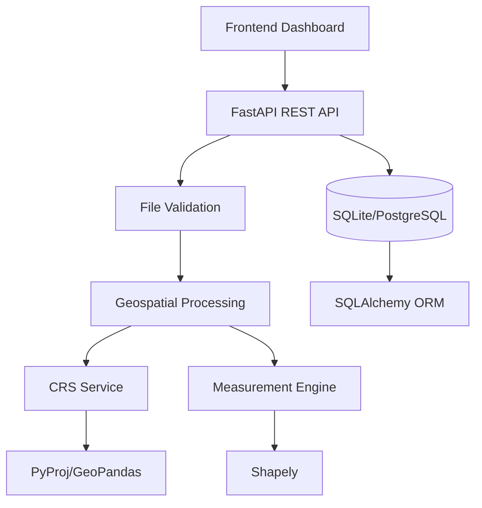

# GeoMeasure API

## Overview

GeoMeasure API is a production-quality geospatial file measurement service that processes KML and Shapefile (ZIP) uploads, extracts features, detects coordinate reference systems (CRS), transforms geometries to appropriate projected coordinate systems, and calculates accurate geometric measurements (area for polygons, length for linestrings).

The application is built as a full-stack solution with a Python FastAPI backend and a React TypeScript frontend, designed to demonstrate clean architecture, proper geospatial processing, and professional API design.

## Features

- **KML Processing** - Parse and extract features from KML files with extended data support
- **Shapefile ZIP Processing** - Validate and process ESRI Shapefile archives (.shp, .shx, .dbf, .prj, .cpg)
- **Feature Extraction** - Extract all features with geometry, properties, and metadata
- **Polygon Area Calculation** - Accurate area measurement in square meters using projected CRS
- **LineString Length Calculation** - Accurate length measurement in meters using projected CRS
- **Point Handling** - Properly handles point geometries (no measurement required)
- **CRS Detection** - Automatic detection of source CRS from file metadata
- **Automatic Projected CRS Selection** - UTM zone calculation based on geometry centroid
- **EPSG:4326 Transformation** - Automatic transformation from geographic to projected CRS
- **Unsupported Geometry Handling** - Graceful handling of MultiPoint, GeometryCollection, etc.
- **Invalid Geometry Repair** - Attempts to repair invalid geometries using `make_valid`
- **Persistent Storage** - SQLite database with SQLAlchemy ORM (PostgreSQL-ready)
- **RESTful API** - Clean API design with proper HTTP status codes and error responses
- **Swagger/OpenAPI Documentation** - Auto-generated API docs at `/docs` and `/redoc`
- **Professional Frontend** - React dashboard with upload, file management, and measurement visualization
- **Comprehensive Testing** - Pytest suite covering CRS, measurements, API endpoints, and edge cases

## Tech Stack

### Backend
- **Python 3.11+** - Modern Python with type hints
- **FastAPI** - High-performance async web framework with automatic OpenAPI generation
- **Pydantic v2** - Data validation and serialization
- **SQLAlchemy 2.0** - Modern ORM with async support
- **GeoPandas** - Geospatial data processing built on pandas
- **Shapely** - Geometry manipulation and analysis
- **PyProj** - Coordinate reference system transformations
- **Fiona** - Shapefile reading
- **FastKML** - KML parsing
- **Uvicorn** - ASGI server
- **Pytest** - Testing framework

### Frontend
- **React 18** - Component-based UI library
- **TypeScript** - Type-safe JavaScript
- **Vite** - Fast build tool and dev server
- **Tailwind CSS** - Utility-first CSS framework
- **React Router** - Client-side routing
- **Axios** - HTTP client
- **React Hot Toast** - Notifications
- **Lucide React** - Icon library

### Infrastructure
- **Docker & Docker Compose** - Containerization
- **SQLite** - Default database (PostgreSQL-compatible)
- **GitHub-ready** - Proper .gitignore, .env.example

## Architecture



## Processing Flow

```
Upload
  ↓
Validate file (extension, size, MIME type, ZIP structure)
  ↓
Detect format (KML vs Shapefile)
  ↓
Extract ZIP if Shapefile (safe extraction, path traversal protection)
  ↓
Read geospatial data (GeoPandas for Shapefile, FastKML for KML)
  ↓
Detect CRS from file metadata (.prj for Shapefile, assumed EPSG:4326 for KML)
  ↓
Extract features with geometries and properties
  ↓
Validate geometries (check validity, attempt repair)
  ↓
Determine measurement CRS:
  - If geographic (EPSG:4326): Calculate UTM zone from centroid
  - If projected: Use existing CRS
  - If missing: Return error (no silent assumption)
  ↓
Transform geometries to measurement CRS (PyProj)
  ↓
Calculate measurements:
  - Polygon/MultiPolygon: Area in m²
  - LineString/MultiLineString: Length in m
  - Point/MultiPoint: No measurement (NOT_REQUIRED)
  - Others: NOT_SUPPORTED
  ↓
Persist results to database
  ↓
Return API response with file info and measurements
```

## CRS Strategy

### Why Latitude/Longitude Cannot Be Used Directly

Geographic coordinate reference systems (like EPSG:4326 - WGS84) use angular units (degrees) for coordinates. Calculating area or distance directly from degrees produces meaningless results because:

1. **Degrees are not constant distance** - One degree of longitude varies from ~111 km at the equator to 0 km at the poles
2. **Area distortion** - A 1°×1° square has vastly different actual area depending on latitude
3. **No planar geometry** - Geographic coordinates are on a sphere/ellipsoid, not a flat plane

### Projected CRS

Projected coordinate systems transform the curved Earth surface to a flat plane using map projections. This enables:
- Euclidean geometry calculations (area, distance)
- Consistent units (typically meters)
- Accurate measurements within the projection's valid area

### UTM Selection Strategy

The Universal Transverse Mercator (UTM) system divides the world into 60 zones, each 6° of longitude wide:

```
Zone = floor((longitude + 180) / 6) + 1
```

- **Northern Hemisphere** (latitude ≥ 0): EPSG:326XX (where XX = zone number)
- **Southern Hemisphere** (latitude < 0): EPSG:327XX

For a feature collection, the centroid of all geometries is used to determine the appropriate UTM zone, ensuring minimal distortion for the dataset's location.

**Example**: Data around India (longitude ~77°, latitude ~28°) → Zone 44 → EPSG:32644

## API Documentation

### POST /api/files/

Upload a geospatial file.

**Request:**
- Content-Type: `multipart/form-data`
- Body: `file` (KML, KMZ, or ZIP containing Shapefile)

**Validation:**
- File extension: `.kml`, `.kmz`, `.zip`
- Max file size: 50 MB
- ZIP must contain `.shp`, `.shx`, `.dbf` (`.prj` optional)

**Response (201):**
```json
{
  "id": "abc123",
  "filename": "survey.kml",
  "feature_count": 120,
  "crs": "EPSG:4326",
  "status": "COMPLETED"
}
```

**Error Responses:**
- 400: Invalid file extension, empty file, corrupt ZIP, missing Shapefile components
- 413: File too large
- 500: Processing failure

### GET /api/files/{id}

Get file information.

**Response (200):**
```json
{
  "id": "abc123",
  "filename": "survey.kml",
  "file_type": "KML",
  "feature_count": 120,
  "crs": "EPSG:4326",
  "measurement_crs": "EPSG:32644",
  "status": "COMPLETED",
  "created_at": "2026-10-07T10:30:00Z",
  "updated_at": "2026-10-07T10:30:00Z",
  "error_message": null
}
```

**Statuses:** `UPLOADED`, `PROCESSING`, `COMPLETED`, `FAILED`

### GET /api/files/{id}/measurements

Get measurements for all features.

**Response (200):**
```json
{
  "file_id": "abc123",
  "crs": "EPSG:4326",
  "measurement_crs": "EPSG:32644",
  "features": [
    {
      "feature_id": 0,
      "geometry_type": "Polygon",
      "properties": { "name": "Plot A" },
      "measurement_type": "area",
      "value": 15432.56,
      "unit": "m²",
      "status": "SUPPORTED",
      "message": null
    },
    {
      "feature_id": 1,
      "geometry_type": "LineString",
      "properties": { "name": "Road 1" },
      "measurement_type": "length",
      "value": 1250.42,
      "unit": "m",
      "status": "SUPPORTED",
      "message": null
    },
    {
      "feature_id": 2,
      "geometry_type": "Point",
      "properties": { "name": "Marker" },
      "measurement_type": null,
      "value": null,
      "unit": null,
      "status": "NOT_REQUIRED",
      "message": "No measurement required for Point geometry"
    }
  ],
  "summary": {
    "file_id": "abc123",
    "feature_count": 3,
    "polygon_count": 1,
    "linestring_count": 1,
    "point_count": 1,
    "total_area_m2": 15432.56,
    "total_length_m": 1250.42,
    "measurement_crs": "EPSG:32644"
  }
}
```

**Measurement Statuses:**
- `SUPPORTED` - Measurement calculated successfully
- `NOT_REQUIRED` - Point geometry (no measurement needed)
- `NOT_SUPPORTED` - Geometry type not supported (MultiPoint, GeometryCollection, etc.)
- `INVALID` - Geometry invalid and could not be repaired

### GET /api/files/

List uploaded files with pagination.

**Query Parameters:**
- `page` (default: 1)
- `page_size` (default: 20, max: 100)

**Response (200):**
```json
{
  "items": [...],
  "total": 150,
  "page": 1,
  "page_size": 20,
  "total_pages": 8
}
```

### DELETE /api/files/{id}

Delete a file and its measurements.

**Response:** 204 No Content

## Local Setup

### Prerequisites
- Python 3.11+
- Node.js 20+
- Git

### VS Code Setup (Recommended)

1. **Open the project in VS Code:**
   ```bash
   code geomap-measurement-api
   ```

2. **Install recommended extensions** (via Extensions panel or `.vscode/extensions.json`):
   - **Python** (ms-python.python) - Python language support
   - **Pylance** (ms-python.vscode-pylance) - Fast Python language server
   - **ESLint** (dbaeumer.vscode-eslint) - JavaScript/TypeScript linting
   - **Prettier** (esbenp.prettier-vscode) - Code formatting
   - **Tailwind CSS IntelliSense** (bradlc.vscode-tailwindcss) - Tailwind autocomplete
   - **REST Client** (humao.rest-client) - Test API endpoints
   - **Docker** (ms-azuretools.vscode-docker) - Docker support
   - **GitLens** (eamodio.gitlens) - Enhanced Git capabilities

3. **Configure Python interpreter:**
   - Press `Ctrl+Shift+P` (or `Cmd+Shift+P` on Mac)
   - Type "Python: Select Interpreter"
   - Choose the venv interpreter: `./backend/venv/bin/python` (or `./backend/venv/Scripts/python.exe` on Windows)

4. **Run configurations** (create `.vscode/launch.json`):
   ```json
   {
     "version": "0.2.0",
     "configurations": [
       {
         "name": "FastAPI Backend",
         "type": "python",
         "request": "launch",
         "module": "uvicorn",
         "args": ["app.main:app", "--reload", "--app-dir", "backend"],
         "cwd": "${workspaceFolder}/backend",
         "env": {
           "PYTHONPATH": "${workspaceFolder}/backend"
         }
       },
       {
         "name": "Frontend Dev",
         "type": "node",
         "request": "launch",
         "runtimeExecutable": "npm",
         "runtimeArgs": ["run", "dev"],
         "cwd": "${workspaceFolder}/frontend"
       }
     ]
   }
   ```

5. **Tasks** (create `.vscode/tasks.json` for common operations):
   ```json
   {
     "version": "2.0.0",
     "tasks": [
       {
         "label": "Install Backend Deps",
         "type": "shell",
         "command": "pip install -r requirements.txt",
         "options": { "cwd": "${workspaceFolder}/backend" }
       },
       {
         "label": "Install Frontend Deps",
         "type": "shell",
         "command": "npm install",
         "options": { "cwd": "${workspaceFolder}/frontend" }
       },
       {
         "label": "Run Backend Tests",
         "type": "shell",
         "command": "pytest -v",
         "options": { "cwd": "${workspaceFolder}/backend" }
       }
     ]
   }
   ```

### Backend

```bash
# Clone repository
git clone <repo-url>
cd geomap-measurement-api

# Create virtual environment
python -m venv venv

# Activate virtual environment
# Windows:
venv\Scripts\activate
# Linux/macOS:
source venv/bin/activate

# Install dependencies
pip install -r backend/requirements.txt

# Run database migrations (SQLAlchemy creates tables automatically)
# Start server
uvicorn app.main:app --reload --app-dir backend

# Server runs at http://localhost:8000
# API docs at http://localhost:8000/docs
# ReDoc at http://localhost:8000/redoc
```

### Frontend

```bash
cd frontend

# Install dependencies
npm install

# Start development server
npm run dev

# Frontend runs at http://localhost:5173
# Proxies API calls to http://localhost:8000
```

### Vercel Deployment (Frontend Only)

The frontend is configured for Vercel deployment. The backend must be deployed separately (Railway, Render, Fly.io, or similar).

#### 1. Deploy Backend (Required First)

**Option A: Railway**
```bash
# Install Railway CLI
npm i -g @railway/cli
railway login
railway init
railway up
```

**Option B: Render**
1. Connect GitHub repo to Render
2. Create Web Service
3. Build command: `pip install -r backend/requirements.txt`
4. Start command: `uvicorn app.main:app --host 0.0.0.0 --port $PORT --app-dir backend`
5. Add environment variables from `.env.example`

**Option C: Fly.io**
```bash
flyctl launch --dockerfile backend/Dockerfile
flyctl deploy
```

**Option D: Docker on any VPS**
```bash
docker build -t geomap-backend ./backend
docker run -d -p 8000:8000 -v $(pwd)/backend/uploads:/app/uploads geomap-backend
```

#### 2. Deploy Frontend to Vercel

**Via Vercel Dashboard:**
1. Push code to GitHub/GitLab/Bitbucket
2. Go to [vercel.com](https://vercel.com) → "Add New Project"
3. Import your repository
4. Configure:
   - **Framework Preset**: Vite
   - **Root Directory**: `frontend`
   - **Build Command**: `npm run vercel-build` (or `npm run build`)
   - **Output Directory**: `dist`
5. Add Environment Variable:
   - `VITE_API_URL` = `https://your-backend-url.com/api`
6. Deploy

**Via Vercel CLI:**
```bash
cd frontend
npm i -g vercel
vercel

# For production:
vercel --prod
```

**Environment Variables in Vercel:**
| Variable | Value | Description |
|----------|-------|-------------|
| `VITE_API_URL` | `https://your-backend.railway.app/api` | Backend API URL |

#### 3. Update CORS in Backend

After getting your Vercel frontend URL, update `backend/app/core/config.py` or set `CORS_ORIGINS` env var:

```python
cors_origins: list[str] = [
    "http://localhost:5173",
    "https://your-project.vercel.app"  # Add your Vercel URL
]
```

### Docker Setup

```bash
# Build and start all services
docker compose up --build

# Backend: http://localhost:8000
# Frontend: http://localhost:5173

# Stop services
docker compose down

# View logs
docker compose logs -f backend
docker compose logs -f frontend
```

## Testing

```bash
# Activate virtual environment first
source venv/bin/activate

# Run all tests
cd backend
pytest

# Run with coverage
pytest --cov=app --cov-report=html

# Run specific test file
pytest app/tests/test_all.py -v

# Run specific test class
pytest app/tests/test_all.py::TestCRSService -v

# Run specific test
pytest app/tests/test_all.py::TestCRSService::test_calculate_utm_crs_northern -v
```

### Test Coverage Areas

1. **KML Upload** - Valid KML with polygons, lines, points
2. **Shapefile ZIP Upload** - Valid Shapefile archives
3. **Invalid ZIP** - Corrupt ZIP, missing components
4. **Missing Shapefile Components** - Missing .shp, .shx, .dbf
5. **Polygon Area Calculation** - Single and multi-polygons
6. **LineString Length Calculation** - Single and multi-linestrings
7. **Point Handling** - Points and multi-points
8. **Unsupported Geometry** - MultiPoint, GeometryCollection
9. **EPSG:4326 Transformation** - Geographic to UTM
10. **Projected CRS Calculation** - Already projected data
11. **Missing CRS Handling** - Clear error messages
12. **Invalid Geometry Handling** - Self-intersecting polygons
13. **File Not Found** - 404 responses
14. **API Response Schemas** - Pydantic validation

## Design Decisions

### Why FastAPI?
- Automatic OpenAPI/Swagger generation
- Native async support for high concurrency
- Pydantic integration for validation
- Excellent performance (Starlette-based)
- Type-safe with Python type hints

### Why GeoPandas?
- Built on pandas - familiar API
- Handles Shapefile reading with Fiona
- CRS management built-in
- Vectorized operations for performance
- Integrates with Shapely and PyProj

### Why Shapely?
- Robust geometry operations
- Area/length calculations
- Geometry validation and repair (`make_valid`)
- Well-tested, widely used in geospatial Python ecosystem

### Why PyProj?
- Industry-standard CRS transformations
- PROJ library bindings
- Accurate datum transformations
- UTM zone calculation support

### Why SQLAlchemy?
- Mature, production-ready ORM
- Database agnostic (SQLite → PostgreSQL)
- Type-safe with 2.0 style
- Relationship management
- Migration support via Alembic

### CRS Selection Strategy
- **Automatic UTM zone selection** based on data centroid
- **No silent EPSG:4326 assumption** - explicit error for missing CRS
- **Projected CRS preservation** - use existing projection when available
- **Measurement CRS returned** - transparency for consumers

### Synchronous Processing Decision
- Simpler architecture for assignment scope
- Adequate for small-to-medium files (<50 MB)
- Can be extended to async/background jobs with Celery/Redis

### Error Handling Strategy
- Structured error responses (error code + message)
- No internal stack traces exposed
- HTTP status codes follow REST conventions
- Validation errors at upload time (fail fast)

## Learning

### Geospatial File Formats
- **KML** - XML-based, hierarchical (Document → Folder → Placemark), supports extended data
- **Shapefile** - Multi-file format (.shp geometry, .shx index, .dbf attributes, .prj projection)
- **ZIP handling** - Safe extraction, structure validation, path traversal prevention

### CRS Concepts
- **Geographic CRS** - Angular coordinates (lat/lon), e.g., EPSG:4326
- **Projected CRS** - Planar coordinates (meters), e.g., UTM zones
- **Datum transformations** - Converting between reference ellipsoids
- **PROJ library** - Industry standard for transformations

### Projection and Coordinate Transformations
- **Always transform before measuring** - Never calculate area/distance in degrees
- **UTM zones** - 6° wide, optimal for local/regional data
- **Centroid-based selection** - Balanced distortion for feature collections
- **PyProj Transformer** - Accurate coordinate conversion

### Geometry Measurement
- **Polygon area** - Planar area in projected CRS (m²)
- **LineString length** - Planar length in projected CRS (m)
- **Multi-geometries** - Sum of component measurements
- **Invalid geometry handling** - `make_valid` for repair, graceful degradation

### FastAPI API Design
- **Pydantic models** - Request/response validation and documentation
- **Dependency injection** - Database sessions, configuration
- **Router organization** - Modular endpoint grouping
- **OpenAPI generation** - Automatic Swagger/ReDoc

### File Validation
- **Extension + MIME type** - Defense in depth
- **ZIP structure validation** - Required Shapefile components
- **Size limits** - Prevent DoS
- **Safe extraction** - Path traversal protection

### Production-Quality Backend Architecture
- **Layered architecture** - Routes → Services → Models
- **Separation of concerns** - Business logic out of route handlers
- **Dependency injection** - Testable, replaceable components
- **Type hints throughout** - IDE support, static analysis
- **Comprehensive logging** - Debugging and monitoring

## Future Scope

- **Async Background Processing** - Celery + Redis for large files
- **PostGIS Integration** - Spatial database with spatial indexing
- **Cloud Object Storage** - S3/GCS for file persistence
- **Large File Processing** - Chunked uploads, streaming processing
- **More Geometry Types** - Curve support, 3D geometries
- **GeoJSON Support** - Native GeoJSON upload and output
- **Map Visualization** - Leaflet/MapLibre integration in frontend
- **Authentication & Authorization** - JWT, API keys, RBAC
- **Rate Limiting** - Per-client request throttling
- **Job Queue** - Celery/Redis for async processing
- **Spatial Indexing** - R-tree indexes for spatial queries
- **Batch Operations** - Multi-file upload and processing
- **Export Formats** - CSV, GeoJSON, Shapefile export
- **Webhooks** - Processing completion notifications
- **Audit Logging** - File access and processing history

## License

This project is created for educational/assignment purposes.

---

## 📦 Project Download

The complete project is available as a ready-to-use ZIP archive:

**Download:** `geomap-measurement-api-20261007-120909.zip` (67.8 KB)

### Contents (67 files)
```
geomap-measurement-api/
├── backend/                    # FastAPI backend
│   ├── app/
│   │   ├── main.py            # Application entry point
│   │   ├── core/              # Config, database
│   │   ├── models/            # SQLAlchemy models
│   │   ├── schemas/           # Pydantic schemas
│   │   ├── services/          # Business logic
│   │   ├── api/routes/        # REST endpoints
│   │   ├── utils/             # Validators, ZIP utils
│   │   └── tests/             # Pytest suite
│   ├── requirements.txt
│   ├── Dockerfile
│   ├── pytest.ini
│   └── sample_data/
├── frontend/                   # React + Vite + TypeScript
│   ├── src/
│   │   ├── components/        # UI components
│   │   ├── pages/             # Page components
│   │   ├── services/          # API client
│   │   ├── types/             # TypeScript types
│   │   └── utils/             # Helpers
│   ├── package.json
│   ├── vite.config.ts
│   ├── tailwind.config.js
│   └── Dockerfile
├── docker-compose.yml
├── vercel.json                # Vercel deployment config
├── .vscode/                   # VS Code configuration
├── README.md
├── .gitignore
└── .env.example
```

### Quick Start from ZIP

```bash
# Extract
unzip geomap-measurement-api-20261007-120909.zip
cd geomap-measurement-api

# Backend
cd backend
python -m venv venv
source venv/bin/activate  # Windows: venv\Scripts\activate
pip install -r requirements.txt
uvicorn app.main:app --reload --app-dir backend

# Frontend (new terminal)
cd frontend
npm install
npm run dev
```

---

**Built with** ❤️ **for backend engineering assessment**